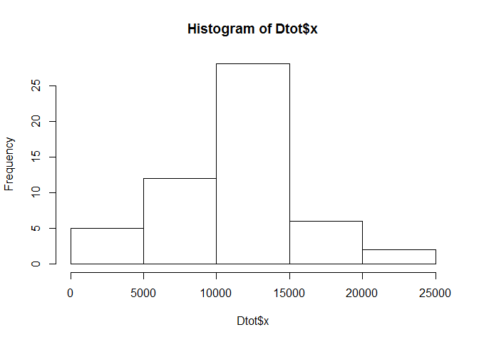
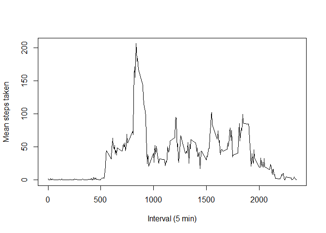
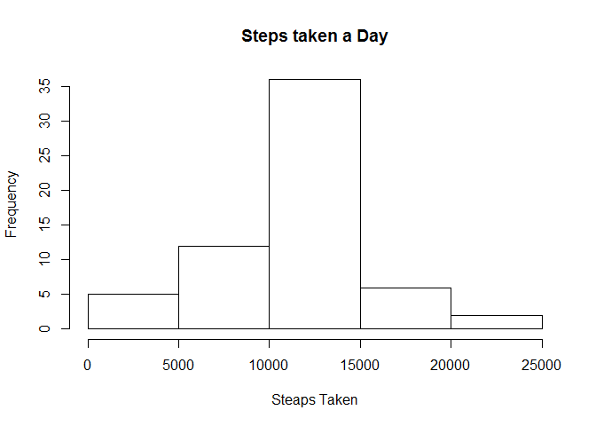
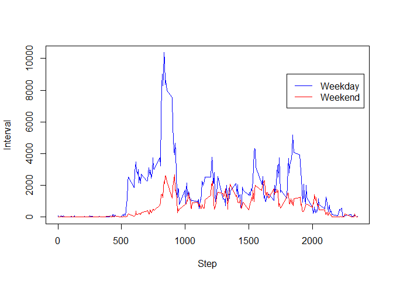

# Activity
Ty Swarts  
August 9, 2016  


```r
library(dplyr)
```

```
## Warning: package 'dplyr' was built under R version 3.2.5
```

```
## 
## Attaching package: 'dplyr'
```

```
## The following objects are masked from 'package:stats':
## 
##     filter, lag
```

```
## The following objects are masked from 'package:base':
## 
##     intersect, setdiff, setequal, union
```

```r
library(lubridate)
```

```
## Warning: package 'lubridate' was built under R version 3.2.5
```

```
## 
## Attaching package: 'lubridate'
```

```
## The following object is masked from 'package:base':
## 
##     date
```

## Homework Week 2

Loading and preprocessing the data


```r
setwd("~/Coursera Data Class/Reproducible Data Analysis/Homework week 2")
data<-read.csv("activity.csv", na.strings = "NA", header = TRUE)
```

#What is mean total number of steps taken per day??---------------------------------------------
#Daily Total

```r
Dtot<-aggregate(data[,1], list(data$date), sum)
Dtot
```

```
##       Group.1     x
## 1  2012-10-01    NA
## 2  2012-10-02   126
## 3  2012-10-03 11352
## 4  2012-10-04 12116
## 5  2012-10-05 13294
## 6  2012-10-06 15420
## 7  2012-10-07 11015
## 8  2012-10-08    NA
## 9  2012-10-09 12811
## 10 2012-10-10  9900
## 11 2012-10-11 10304
## 12 2012-10-12 17382
## 13 2012-10-13 12426
## 14 2012-10-14 15098
## 15 2012-10-15 10139
## 16 2012-10-16 15084
## 17 2012-10-17 13452
## 18 2012-10-18 10056
## 19 2012-10-19 11829
## 20 2012-10-20 10395
## 21 2012-10-21  8821
## 22 2012-10-22 13460
## 23 2012-10-23  8918
## 24 2012-10-24  8355
## 25 2012-10-25  2492
## 26 2012-10-26  6778
## 27 2012-10-27 10119
## 28 2012-10-28 11458
## 29 2012-10-29  5018
## 30 2012-10-30  9819
## 31 2012-10-31 15414
## 32 2012-11-01    NA
## 33 2012-11-02 10600
## 34 2012-11-03 10571
## 35 2012-11-04    NA
## 36 2012-11-05 10439
## 37 2012-11-06  8334
## 38 2012-11-07 12883
## 39 2012-11-08  3219
## 40 2012-11-09    NA
## 41 2012-11-10    NA
## 42 2012-11-11 12608
## 43 2012-11-12 10765
## 44 2012-11-13  7336
## 45 2012-11-14    NA
## 46 2012-11-15    41
## 47 2012-11-16  5441
## 48 2012-11-17 14339
## 49 2012-11-18 15110
## 50 2012-11-19  8841
## 51 2012-11-20  4472
## 52 2012-11-21 12787
## 53 2012-11-22 20427
## 54 2012-11-23 21194
## 55 2012-11-24 14478
## 56 2012-11-25 11834
## 57 2012-11-26 11162
## 58 2012-11-27 13646
## 59 2012-11-28 10183
## 60 2012-11-29  7047
## 61 2012-11-30    NA
```
#Histogram

```r
hist(Dtot$x)
```

<!-- -->
#Mean

```r
Dmean<-aggregate(data[,1], list(data$date), mean)
Dmean
```

```
##       Group.1          x
## 1  2012-10-01         NA
## 2  2012-10-02  0.4375000
## 3  2012-10-03 39.4166667
## 4  2012-10-04 42.0694444
## 5  2012-10-05 46.1597222
## 6  2012-10-06 53.5416667
## 7  2012-10-07 38.2465278
## 8  2012-10-08         NA
## 9  2012-10-09 44.4826389
## 10 2012-10-10 34.3750000
## 11 2012-10-11 35.7777778
## 12 2012-10-12 60.3541667
## 13 2012-10-13 43.1458333
## 14 2012-10-14 52.4236111
## 15 2012-10-15 35.2048611
## 16 2012-10-16 52.3750000
## 17 2012-10-17 46.7083333
## 18 2012-10-18 34.9166667
## 19 2012-10-19 41.0729167
## 20 2012-10-20 36.0937500
## 21 2012-10-21 30.6284722
## 22 2012-10-22 46.7361111
## 23 2012-10-23 30.9652778
## 24 2012-10-24 29.0104167
## 25 2012-10-25  8.6527778
## 26 2012-10-26 23.5347222
## 27 2012-10-27 35.1354167
## 28 2012-10-28 39.7847222
## 29 2012-10-29 17.4236111
## 30 2012-10-30 34.0937500
## 31 2012-10-31 53.5208333
## 32 2012-11-01         NA
## 33 2012-11-02 36.8055556
## 34 2012-11-03 36.7048611
## 35 2012-11-04         NA
## 36 2012-11-05 36.2465278
## 37 2012-11-06 28.9375000
## 38 2012-11-07 44.7326389
## 39 2012-11-08 11.1770833
## 40 2012-11-09         NA
## 41 2012-11-10         NA
## 42 2012-11-11 43.7777778
## 43 2012-11-12 37.3784722
## 44 2012-11-13 25.4722222
## 45 2012-11-14         NA
## 46 2012-11-15  0.1423611
## 47 2012-11-16 18.8923611
## 48 2012-11-17 49.7881944
## 49 2012-11-18 52.4652778
## 50 2012-11-19 30.6979167
## 51 2012-11-20 15.5277778
## 52 2012-11-21 44.3993056
## 53 2012-11-22 70.9270833
## 54 2012-11-23 73.5902778
## 55 2012-11-24 50.2708333
## 56 2012-11-25 41.0902778
## 57 2012-11-26 38.7569444
## 58 2012-11-27 47.3819444
## 59 2012-11-28 35.3576389
## 60 2012-11-29 24.4687500
## 61 2012-11-30         NA
```
#Median

```r
Dmedian<-aggregate(data[,1], list(data$date), median)
Dmedian
```

```
##       Group.1  x
## 1  2012-10-01 NA
## 2  2012-10-02  0
## 3  2012-10-03  0
## 4  2012-10-04  0
## 5  2012-10-05  0
## 6  2012-10-06  0
## 7  2012-10-07  0
## 8  2012-10-08 NA
## 9  2012-10-09  0
## 10 2012-10-10  0
## 11 2012-10-11  0
## 12 2012-10-12  0
## 13 2012-10-13  0
## 14 2012-10-14  0
## 15 2012-10-15  0
## 16 2012-10-16  0
## 17 2012-10-17  0
## 18 2012-10-18  0
## 19 2012-10-19  0
## 20 2012-10-20  0
## 21 2012-10-21  0
## 22 2012-10-22  0
## 23 2012-10-23  0
## 24 2012-10-24  0
## 25 2012-10-25  0
## 26 2012-10-26  0
## 27 2012-10-27  0
## 28 2012-10-28  0
## 29 2012-10-29  0
## 30 2012-10-30  0
## 31 2012-10-31  0
## 32 2012-11-01 NA
## 33 2012-11-02  0
## 34 2012-11-03  0
## 35 2012-11-04 NA
## 36 2012-11-05  0
## 37 2012-11-06  0
## 38 2012-11-07  0
## 39 2012-11-08  0
## 40 2012-11-09 NA
## 41 2012-11-10 NA
## 42 2012-11-11  0
## 43 2012-11-12  0
## 44 2012-11-13  0
## 45 2012-11-14 NA
## 46 2012-11-15  0
## 47 2012-11-16  0
## 48 2012-11-17  0
## 49 2012-11-18  0
## 50 2012-11-19  0
## 51 2012-11-20  0
## 52 2012-11-21  0
## 53 2012-11-22  0
## 54 2012-11-23  0
## 55 2012-11-24  0
## 56 2012-11-25  0
## 57 2012-11-26  0
## 58 2012-11-27  0
## 59 2012-11-28  0
## 60 2012-11-29  0
## 61 2012-11-30 NA
```

#What is the average daily activity pattern?


```r
data_na <- filter(data,!is.na(data$steps))
data_int <- aggregate(data=data_na,steps ~ interval,mean)


plot(data_int$interval,data_int$steps,type="l",xlab="Interval (5 min)", ylab="Mean steps taken")
```

<!-- -->

#Imputing missing values----------------------------------------------------------------

#Caculate total number of NAs


```r
summary(data)
```

```
##      steps                date          interval     
##  Min.   :  0.00   2012-10-01:  288   Min.   :   0.0  
##  1st Qu.:  0.00   2012-10-02:  288   1st Qu.: 588.8  
##  Median :  0.00   2012-10-03:  288   Median :1177.5  
##  Mean   : 37.38   2012-10-04:  288   Mean   :1177.5  
##  3rd Qu.: 12.00   2012-10-05:  288   3rd Qu.:1766.2  
##  Max.   :806.00   2012-10-06:  288   Max.   :2355.0  
##  NA's   :2304     (Other)   :15840
```

```r
summary(data)
```

```
##      steps                date          interval     
##  Min.   :  0.00   2012-10-01:  288   Min.   :   0.0  
##  1st Qu.:  0.00   2012-10-02:  288   1st Qu.: 588.8  
##  Median :  0.00   2012-10-03:  288   Median :1177.5  
##  Mean   : 37.38   2012-10-04:  288   Mean   :1177.5  
##  3rd Qu.: 12.00   2012-10-05:  288   3rd Qu.:1766.2  
##  Max.   :806.00   2012-10-06:  288   Max.   :2355.0  
##  NA's   :2304     (Other)   :15840
```

```r
data_rep <- data
data_na_num <- is.na(data_rep$steps)
data_mean_rep <- tapply(data_rep$steps,data_rep$interval,mean,na.rm=T)
data_rep$steps[data_na_num] <- data_mean_rep[as.character(data_rep$interval[data_na_num])]
data_comp <- tapply(data_rep$steps,data_rep$date,sum)

hist(data_comp, xlab="Steaps Taken", main = "Steps taken a Day")
```

<!-- -->

#Are there differences in activity patterns between weekdays and weekends?---------------------

```r
data_rep$date<-ymd(data_rep$date)

days<-weekdays(data_rep$date)
```
#Assign weekdays to weekdays

```r
days<-replace(days, days=="Monday", "Weekday")
days<-replace(days, days=="Tuesday", "Weekday")
days<-replace(days, days=="Wednesday", "Weekday")
days<-replace(days, days=="Thursday", "Weekday")
days<-replace(days, days=="Friday", "Weekday")
days<-replace(days, days=="Saturday", "Weekend")
days<-replace(days, days=="Sunday", "Weekend")
data_rep$days<-days
```
#filter Subsets

```r
weekend<-filter(data_rep,days=="Weekend")
weekday<-filter(data_rep,days=="Weekday")
weekend <- aggregate(weekend$steps,list(weekend$interval, weekend$days),sum)
weekday <- aggregate(weekday$steps,list(weekday$interval, weekday$days),sum)
```
#Plot Graphs

```r
plot(weekday$Group.1,weekday$x, col="blue", type = "l", xlab = "Step", ylab = "Interval")
lines(weekend$Group.1,weekend$x, col="red", type = "l")
legend(1800, 9000, c("Weekday","Weekend"), lty=c(1,1), col=c("blue","red"))
```

<!-- -->
